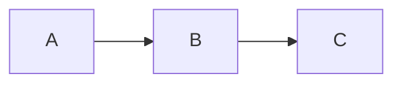
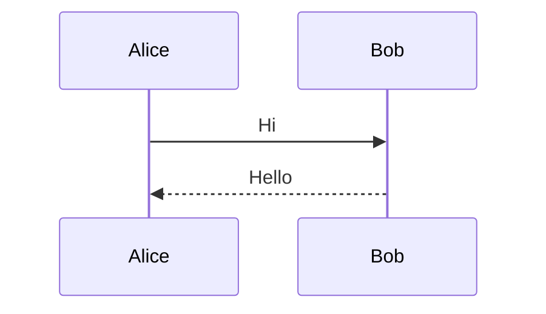

# Sample

## 表とタスク
| a | b |
|---|---|
| 1 | 2 |

- [x] done
- [ ] todo

~~strike~~ https://example.com

```js
const x = 1;
```


```mermaid
flowchart LR
  A --> B --> C
```


```mermaid
sequenceDiagram
  Alice->>Bob: Hi
  Bob-->>Alice: Hello
```

```mermaid
bad syntax here
```
